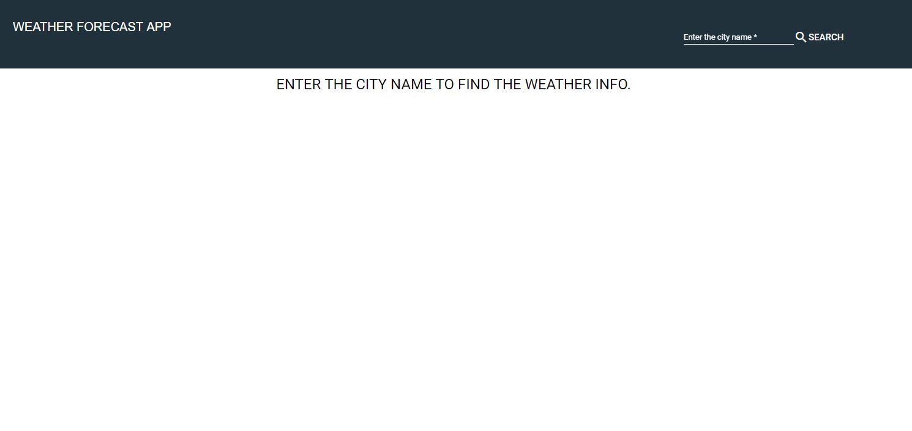
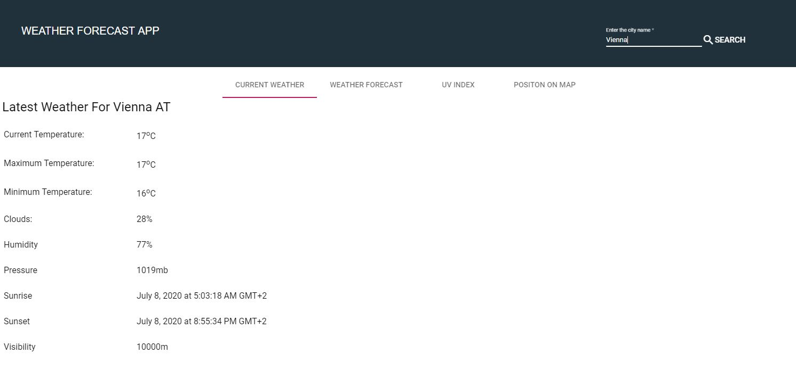
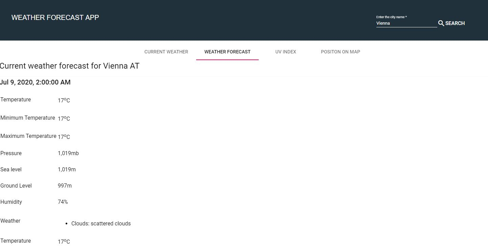
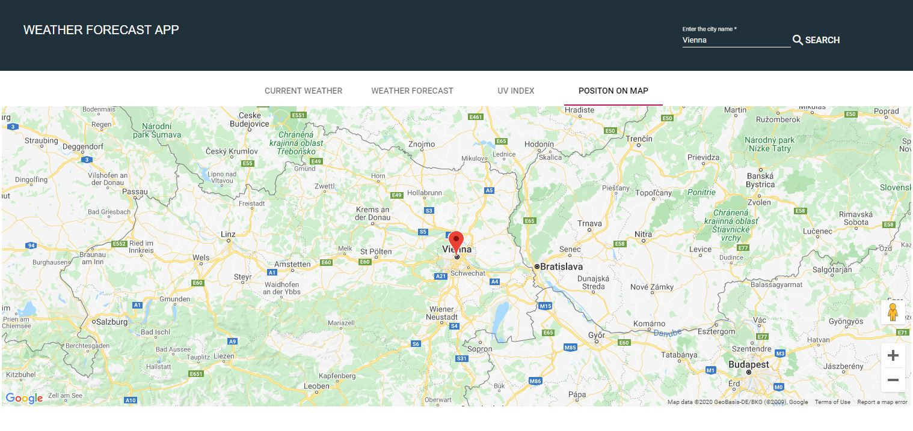
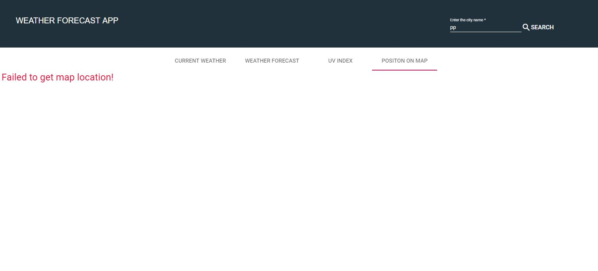

# AngularWeatherApp

This project was generated with [Angular CLI](https://github.com/angular/angular-cli) version 9.1.6.
This is a simple weather app generated using Angular Framework, which can be used to search weather details of a city or a country as the case maybe. It shows the day time, night time, minimum temperature including the maximum temperature for each day offering maximum convenience to the end user. More so, it displays the location of the city on the map (google map) based on the user input.

# Outputs
     

## Development server

Run `ng serve` for a dev server. Navigate to `http://localhost:4200/`. The app will automatically reload if you change any of the source files.

## Code scaffolding

Run `ng generate component component-name` to generate a new component. You can also use `ng generate directive|pipe|service|class|guard|interface|enum|module`.

## Build

Run `ng build` to build the project. The build artifacts will be stored in the `dist/` directory. Use the `--prod` flag for a production build.

## Running unit tests

Run `ng test` to execute the unit tests via [Karma](https://karma-runner.github.io).

## Running end-to-end tests

Run `ng e2e` to execute the end-to-end tests via [Protractor](http://www.protractortest.org/).

## Further help

To get more help on the Angular CLI use `ng help` or go check out the [Angular CLI README](https://github.com/angular/angular-cli/blob/master/README.md).

# Contact
* Repo created by <a href="https://github.com/Mbboutidem">Mbuotidem</a>
